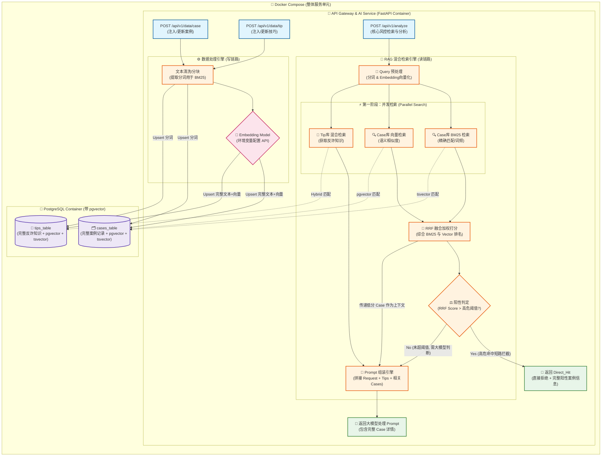

# Anti-Fraud RAG System (反诈骗 RAG 检索引擎)

## 📌 项目简介 (Project Overview)

本项目是一个专门针对**诈骗信息识别**设计的 RAG (Retrieval-Augmented Generation) 架构。其核心目标是接收用户的可疑请求（Request），通过多路召回与增强检索机制，结合图数据库和关系型数据库中的反诈知识与历史案例，输出经过深度分析和处理后的风险评估文本（Text）。

整体交互被封装为一个高度集成的核心类，调用方仅需提供 `request` 即可获取处理后的安全建议与诈骗识别结果。

## 🏗️ 核心架构设计 (Architecture Design)

本系统采用**单轨RRF融合检索架构**，通过混合检索策略平衡精确匹配与语义理解能力：

### 1. 混合检索机制 (Hybrid Retrieval)

系统采用**多路并发检索 + RRF融合打分**策略：

*   **BM25 精确匹配检索**
    *   基于词频和逆文档频率的经典信息检索算法
    *   利用 PostgreSQL 内置 `tsvector` 实现全文搜索
    *   适用于关键词高度匹配的诈骗话术识别
*   **向量语义检索**
    *   基于文本嵌入模型的语义相似度计算
    *   利用 `pgvector` 扩展实现近似最近邻（ANN）搜索
    *   适用于语义相近但表述不同的新型诈骗识别
*   **RRF (Reciprocal Rank Fusion) 融合**
    *   综合多路检索结果进行加权排名
    *   公式：`RRF_score = Σ(1/(k+rank))`，其中 k=60
    *   避免单一检索方式的偏差，提高召回准确性

### 2. 双库隔离设计 (Database Layer)

系统底层依托 PostgreSQL + pgvector 实现混合存储：

*   **案例库 (cases_table)**：存储诈骗案例全文 + 向量 + 分词索引
*   **知识库 (tips_table)**：存储反诈知识文档 + 向量 + 分词索引

### 3. 数据隔离原则 (Data Partitioning)

为了保证检索的精确度与业务逻辑的清晰，系统中涉及的核心数据被物理/逻辑隔离为两部分：
*   **📚 反诈知识数据 (Anti-Fraud Knowledge DB)**：包含诈骗手段科普、法律法规、诈骗话术模板、固定的风控规则库（偏静态与常识）。
*   **📂 案例数据库 (Case DB)**：历史发生过的真实诈骗案件、已经被确认的恶意节点网络、资金链追踪溯源案例（偏动态与实体网络）。

---

## ⚙️ 环境配置 (Environment Configuration)

系统使用**嵌入模型 API** 进行文本向量化，需要在部署前配置以下环境变量：

```bash
# 嵌入模型 API 配置 (必需)
EMBEDDING_MODEL_URL=https://your-embedding-api-endpoint.com/v1/embeddings
EMBEDDING_MODEL_API_KEY=your-api-key-here

# 可选配置
EMBEDDING_MODEL_NAME=text-embedding-ada-002  # 模型名称
EMBEDDING_DIMENSION=1536                       # 向量维度
HIGH_RISK_THRESHOLD=0.85                       # 高危判定阈值 (0-1)
PORT=8000                                       # 服务端口
```

**配置说明：**
- `EMBEDDING_MODEL_URL`: 嵌入模型的 API 端点地址（支持 OpenAI 兼容接口）
- `EMBEDDING_MODEL_API_KEY`: API 密钥，用于身份验证
- `EMBEDDING_DIMENSION`: 向量维度，需与嵌入模型输出保持一致（默认 1536）
- `HIGH_RISK_THRESHOLD`: RRF综合分数阈值，超过此值直接返回高危告警
- 系统会在启动时验证必需的环境变量，缺失将导致服务无法正常启动

---

### 📡 API 详细设计

#### 1. 核心风控分析接口

**接口地址**: `POST /api/v1/analyze`

**请求体 (Request Body)**:
```json
{
  "request": {
    "text": "对方声称是公安局，说我涉嫌洗钱...",
    "source": "user_submission",
    "metadata": {
      "user_id": "optional_user_id",
      "channel": "web"
    }
  }
}
```

**响应体 (Response - Direct_Hit 高危)**:
```json
{
  "status": "success",
  "result_type": "Direct_Hit",
  "data": {
    "risk_level": "HIGH",
    "matched_cases": [
      {
        "case_id": "case_001",
        "description": "冒充公检法诈骗",
        "confidence": 0.92,
        "fraud_type": "冒充公检法",
        "key_indicators": ["声称涉嫌违法", "要求转账到安全账户"]
      }
    ],
    "recommended_action": "停止一切操作，立即报警"
  }
}
```

**响应体 (Response - RAG_Prompt 需LLM判断)**:
```json
{
  "status": "success",
  "result_type": "RAG_Prompt",
  "data": {
    "risk_level": "MEDIUM",
    "rrf_score": 0.68,
    "prompt": "你是一个反诈骗助手。用户遇到的情况是：...",
    "context": {
      "relevant_cases": [...],
      "anti_fraud_tips": [...]
    }
  }
}
```

---

#### 2. 案例数据注入接口

**接口地址**: `POST /api/v1/data/case`

**请求体 (Request Body)**:
```json
{
  "case": {
    "description": "冒充客服诈骗：对方声称支付宝客服...",
    "fraud_type": "冒充客服",
    "amount": 50000,
    "description_embedding": "base64_encoded_vector",
    "keywords": ["客服", "退款", "银行卡"]
  }
}
```

**响应体 (Response)**:
```json
{
  "status": "success",
  "message": "案例注入成功",
  "case_id": "auto_generated_uuid"
}
```

---

#### 3. 反诈知识注入接口

**接口地址**: `POST /api/v1/data/tip`

**请求体 (Request Body)**:
```json
{
  "tip": {
    "title": "如何识别冒充公检法诈骗",
    "content": "公检法机关不会通过电话办案...",
    "category": "防骗指南",
    "keywords": ["公检法", "电话办案", "安全账户"]
  }
}
```

**响应体 (Response)**:
```json
{
  "status": "success",
  "message": "知识注入成功",
  "tip_id": "auto_generated_uuid"
}
```

---

#### 4. 错误码定义

| 错误码 | 错误类型 | 说明 | HTTP 状态码 |
|--------|----------|------|-------------|
| 1001 | VALIDATION_ERROR | 请求参数校验失败 | 400 |
| 1002 | EMBEDDING_ERROR | 嵌入模型调用失败 | 502 |
| 1003 | DATABASE_ERROR | 数据库操作异常 | 500 |
| 1004 | CASE_NOT_FOUND | 指定案例不存在 | 404 |
| 1005 | TIP_NOT_FOUND | 指定知识不存在 | 404 |
| 2001 | RATE_LIMIT_EXCEEDED | 请求频率超限 | 429 |
| 2002 | AUTH_FAILED | 认证失败 | 401 |

---

#### 5. 认证与限流策略

**认证机制**:
- 采用 API Key 认证，请求 Header 中携带 `X-API-Key`
- 示例: `X-API-Key: your_api_key_here`

**限流策略**:
- 默认限制: 100 requests/minute/IP
- 超过限制返回 429 状态码，响应头中包含 `Retry-After` 字段

---

## 🗺️ 系统架构图 (Architecture Diagram)



---

## 🛠️ 模块与接口定义 (Interface Definition)

### `AntiFraudRAG` 类

负责接收外部输入，协调底层数据库与检索路线，并调度 LLM 完成风险文本生成。

**核心方法:**
*   **输入:** `request` (包含用户咨询文本、请求来源等属性)。
*   **输出:** 处理完成后的防御/分析 `text`。

**数据流转逻辑:**
1.  **Request 解析**：提取文本特征，进行分词和向量化预处理。
2.  **分库检索**：
    *   分别查询 **反诈知识库**（提取套路特征）和 **案例数据库**（匹配历史相似案件）。
    *   并发执行 BM25 检索和向量检索。
3.  **RRF 融合与排序**：综合多路检索结果，计算融合分数。
4.  **阈值判定**：
    *   高危命中（分数 > HIGH_RISK_THRESHOLD）：直接返回告警
    *   正常范围：组装 Prompt 送交 LLM 生成分析结果。

---

## 🔧 模块实现细节 (Implementation Details)

### 1. 数据处理引擎 (Data Processing Pipeline)

#### 1.1 文本清洗与预处理
- **清洗规则**：去除 HTML 标签、特殊字符规范化、空格Trim
- **编码处理**：统一 UTF-8 编码

#### 1.2 文本分块 (Chunking)
- **分块策略**：按段落/句子拆分，保留上下文连贯性
- **块大小**：建议 500-1000 字符，重叠 50-100 字符
- **元数据保留**：保留来源、分类、创建时间等信息

#### 1.3 分词索引 (BM25)
- **分词器**：使用 PostgreSQL 内置 `zhparser` 中文分词器
- **索引字段**：创建 `tsvector` 索引列
- **权重配置**：标题权重 2.0，正文权重 1.0

#### 1.4 向量化 (Embedding)
- **模型调用**：通过 HTTP 请求调用嵌入模型 API
- **批处理**：支持批量向量化（建议 batch_size=100）
- **向量存储**：使用 pgvector 的 `vector` 类型存储

---

### 2. RAG 检索引擎 (Retrieval Engine)

#### 2.1 Query 预处理
- 文本清洗（与写入流程一致）
- 分词处理（生成 BM25 查询词）
- 向量化（生成查询向量）

#### 2.2 BM25 检索
```sql
SELECT id, content, ts_rank(to_tsvector('zhparser', content), query) as rank
FROM cases_table
WHERE to_tsvector('zhparser', content) @@ plainto_tsquery('zhparser', $query)
ORDER BY rank DESC
LIMIT 20;
```

#### 2.3 向量检索
```sql
SELECT id, content, 1 - (embedding <=> $query_vector) as similarity
FROM cases_table
ORDER BY embedding <=> $query_vector
LIMIT 20;
```

#### 2.4 RRF 融合算法
```python
def rrf_fusion(bm25_results, vector_results, k=60):
    scores = {}
    for rank, (doc_id, score) in enumerate(bm25_results):
        scores[doc_id] = scores.get(doc_id, 0) + 1 / (k + rank + 1)
    for rank, (doc_id, score) in enumerate(vector_results):
        scores[doc_id] = scores.get(doc_id, 0) + 1 / (k + rank + 1)
    return sorted(scores.items(), key=lambda x: x[1], reverse=True)
```

#### 2.5 阈值判定逻辑
- **HIGH_RISK_THRESHOLD** (默认 0.85)：直接返回 Direct_Hit
- **正常范围**：返回 Top-10 结果作为 LLM 上下文

#### 2.6 Prompt 组装
```
你是一个专业的反诈骗助手。请根据以下案例信息和反诈知识，
分析用户遇到的情况是否属于诈骗，并给出专业的判断和建议。

【用户咨询】
{user_request}

【相关案例】
{case_1}
{case_2}
...

【反诈知识】
{tip_1}
{tip_2}
...

请给出你的分析：
```

---

### 3. 数据库设计 (Database Schema)

#### 3.1 cases_table (案例表)
```sql
CREATE TABLE cases_table (
    id UUID PRIMARY KEY DEFAULT gen_random_uuid(),
    description TEXT NOT NULL,           -- 案例描述全文
    fraud_type VARCHAR(100),             -- 诈骗类型
    amount DECIMAL(15,2),                -- 涉案金额
    keywords TEXT[],                     -- 关键词数组
    embedding VECTOR(1536),              -- 向量索引 (需 pgvector)
    content_tsv TSVECTOR,                -- 全文搜索索引
    created_at TIMESTAMP DEFAULT NOW(),
    updated_at TIMESTAMP DEFAULT NOW()
);

-- 向量索引 (IVFFlat 或 HNSW)
CREATE INDEX ON cases_table USING ivfflat (embedding vector_cosine_ops)
WITH (lists = 100);

-- 全文搜索索引
CREATE INDEX ON cases_table USING GIN (content_tsv);
```

#### 3.2 tips_table (反诈知识表)
```sql
CREATE TABLE tips_table (
    id UUID PRIMARY KEY DEFAULT gen_random_uuid(),
    title VARCHAR(500) NOT NULL,          -- 标题
    content TEXT NOT NULL,                -- 知识内容全文
    category VARCHAR(100),                -- 分类
    keywords TEXT[],                      -- 关键词
    embedding VECTOR(1536),               -- 向量索引
    content_tsv TSVECTOR,                 -- 全文搜索索引
    created_at TIMESTAMP DEFAULT NOW(),
    updated_at TIMESTAMP DEFAULT NOW()
);

CREATE INDEX ON tips_table USING ivfflat (embedding vector_cosine_ops)
WITH (lists = 50);

CREATE INDEX ON tips_table USING GIN (content_tsv);
```

---

## 🧪 测试与部署 (Testing & Deployment)

### 1. 测试策略

#### 1.1 单元测试
- **数据处理模块**：文本清洗、分块、向量化
- **检索模块**：BM25 查询、向量检索、RRF 融合
- **API 模块**：请求校验、响应格式化

#### 1.2 集成测试
- 端到端流程测试（写入 -> 检索 -> 返回）
- 多路检索结果一致性验证
- 阈值判定准确性测试

#### 1.3 性能测试
- **基准**：1000条案例 / 500条知识
- **目标指标**：
  - 写入吞吐量：50 docs/s
  - 查询延迟 P99：< 200ms
  - 并发支持：100 QPS

### 2. 部署方案

#### 2.1 Docker Compose 配置
```yaml
version: '3.8'
services:
  app:
    build: .
    ports:
      - "8000:8000"
    environment:
      - EMBEDDING_MODEL_URL=${EMBEDDING_MODEL_URL}
      - EMBEDDING_MODEL_API_KEY=${EMBEDDING_MODEL_API_KEY}
      - EMBEDDING_DIMENSION=1536
      - HIGH_RISK_THRESHOLD=0.85
      - DATABASE_URL=postgresql://user:pass@db:5432/antifraud
    depends_on:
      - db

  db:
    image: pgvector/pgvector:pg16
    environment:
      - POSTGRES_USER=user
      - POSTGRES_PASSWORD=pass
      - POSTGRES_DB=antifraud
    volumes:
      - pgdata:/var/lib/postgresql/data
    ports:
      - "5432:5432"

volumes:
  pgdata:
```

#### 2.2 环境变量清单
| 变量名 | 必填 | 默认值 | 说明 |
|--------|------|--------|------|
| EMBEDDING_MODEL_URL | 是 | - | 嵌入模型 API 地址 |
| EMBEDDING_MODEL_API_KEY | 是 | - | API 密钥 |
| EMBEDDING_DIMENSION | 否 | 1536 | 向量维度 |
| HIGH_RISK_THRESHOLD | 否 | 0.85 | 高危阈值 |
| DATABASE_URL | 否 | postgresql://... | 数据库连接串 |
| PORT | 否 | 8000 | 服务端口 |
| LOG_LEVEL | 否 | INFO | 日志级别 |

#### 2.3 监控与日志
- **日志**：结构化 JSON 日志，包含请求 ID、耗时、结果类型
- **指标**：Prometheus 暴露指标（QPS、延迟、命中率）
- **健康检查**：`GET /health` 端点

---

## 🗺️ 开发路线图 (Roadmap)

### MVP (Minimum Viable Product) - 2周

**目标**：完成核心检索功能

| 任务 | 描述 | 预估工时 |
|------|------|----------|
| 基础设施 | 项目骨架、依赖配置、Docker环境 | 1天 |
| 数据库设计 | 表结构、索引、初始化脚本 | 2天 |
| 数据写入 | 文本清洗、分块、向量化、存储 | 3天 |
| 检索实现 | BM25检索、向量检索、RRF融合 | 3天 |
| API封装 | FastAPI接口、请求响应处理 | 2天 |
| 基础测试 | 单元测试、集成测试 | 3天 |

**交付物**：可运行的 RAG 检索服务，支持案例和知识的写入与查询

---

### V1.0 (正式版本) - 3周

**目标**：完善功能、稳定性能

| 任务 | 描述 | 预估工时 |
|------|------|----------|
| Prompt优化 | 完善LLM提示词、提升分析质量 | 1周 |
| 性能优化 | 索引调优、缓存、连接池 | 1周 |
| 高危判定 | 阈值策略优化、告警逻辑 | 1周 |
| 监控告警 | 日志、指标、健康检查 | 1周 |
| 文档完善 | API文档、部署文档 | 1周 |

**交付物**：生产可用的反诈骗 RAG 系统

---

### V2.0 (增强版本) - 4周

**目标**：高级特性、持续迭代

| 任务 | 描述 | 预估工时 |
|------|------|----------|
| 增量更新 | 支持案例/知识的增量更新与删除 | 1周 |
| 多租户 | 租户隔离、数据权限控制 | 1周 |
| 缓存层 | Redis缓存热点数据 | 1周 |
| 批量接口 | 支持批量导入/导出 | 1周 |
| 高级分析 | 诈骗趋势分析、统计报表 | 1周 |

**交付物**：功能完备的企业级反诈检索平台
